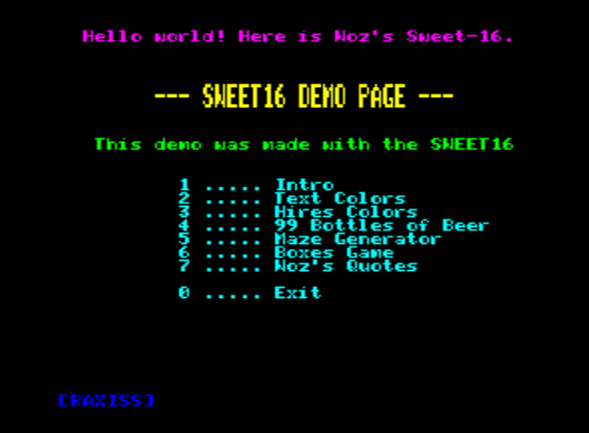

```
              _
  ___ ___ _ _|_|___ ___ (c) 2019,2020
 |  _| .'|_'_| |_ -|_ -|
 |_| |__,|_,_|_|___|___|
         presents

```
# Swiss16 - Sweet16 for Oric

This is Woz's Sweet16 extended port
for Oric-1/Atmos/Telestrat/Pravetz-8D

### More info about Sweet16
http://www.6502.org/source/interpreters/sweet16.htm


### Credits:

##### Steve Wozniak for Sweet16:
THE APPLE-II PSEUDO MACHINE INTERPRETER
COPYRIGHT (C) 1977 APPLE COMPUTER, INC

##### Christian/Assinie for the idea of a portable definition of registers:
http://oric.forumactif.org/t208-pilot-focal-brainfuck-what-else#2825

##### Andy McFadden for fhpack - compression for 6502
https://github.com/fadden/fhpack

##### Cheers to BARRYM for the BEER SONG source code:
http://forum.6502.org/viewtopic.php?f=2&t=3049#p34606

<br><br><table><tr><td>  </td></tr></table>
